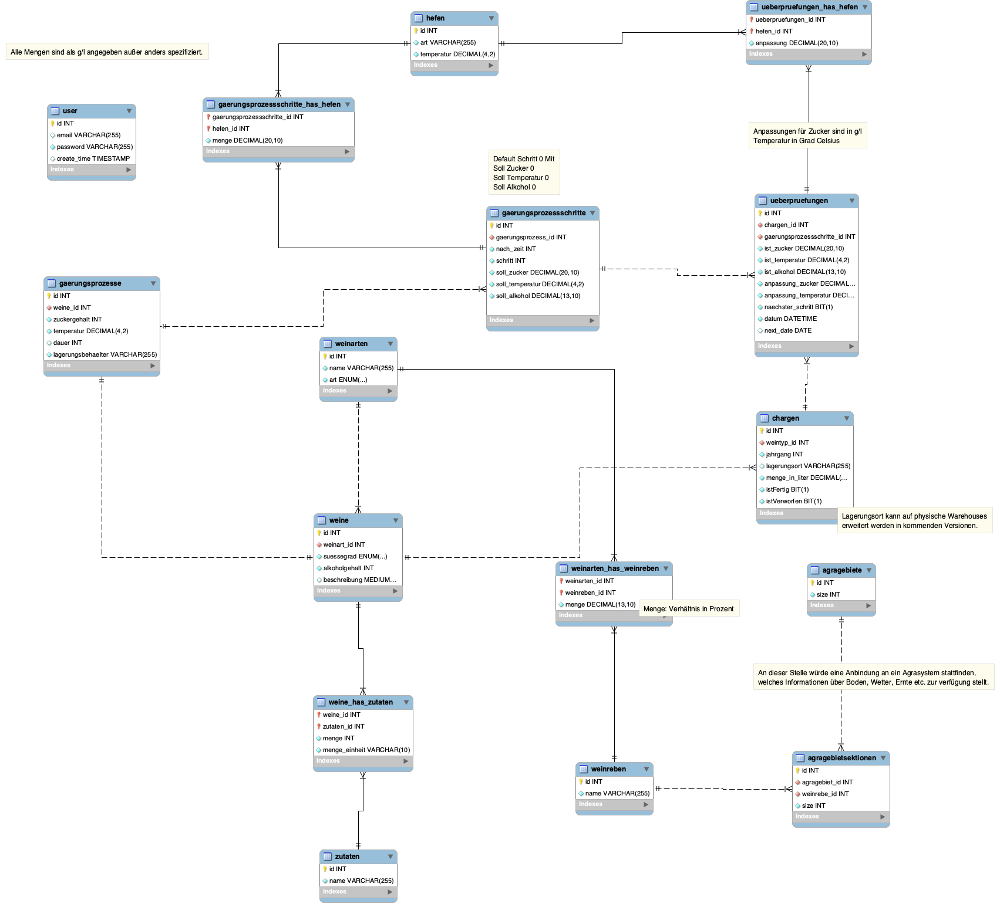
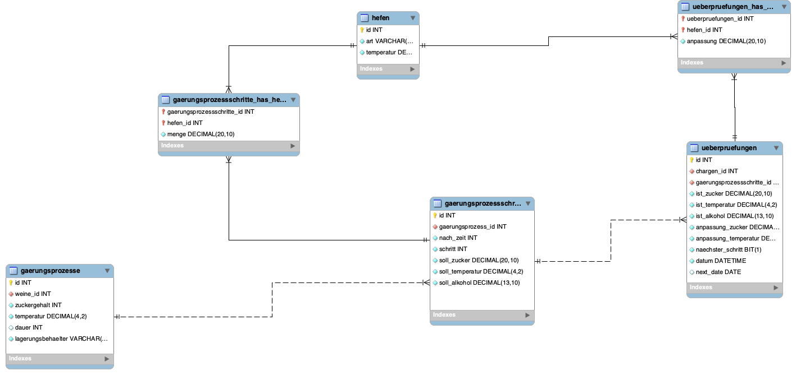

# Data Model
The entire project is based upon the following data model:

In order for the project to enable continuous development of the database to be continuously developed,
the data model was designed in [MySQL Workbench](https://www.mysql.com/products/workbench/).

To work on the data model you can download the model from [Weingut Merlot.mwb](Weingut%20Merlot.mwb)

The model is annotated with comments and can be expanded in many directions,
e.g. by expanding a warehouse system to the Charge entity or an agricultural management system to the 
Agrargebietsektionen.

## Dotted and Non-Dotted lines
When modeling, we do not differentiate between dotted and non-dotted lines. 
MySQL Workbench includes this feature, but we do not attach any semantic meaning to either dotted or non-dotted lines.
Only the endings (1:1, 1:n, n:m) are relevant for us.

## Large scale view of implemented Data model
The section that is most relevant for the implementation looks as follows:

## Generating the Datamodel
To generate the initialize.sql script from MySQL workbench, you can use the *Forward Engineer SQL Create script* option.
To see which options are recommended, see the [wiki](https://github.com/ItsZiroy/atit-weingut-merlot/wiki/Generating-SQL-Create-script).

